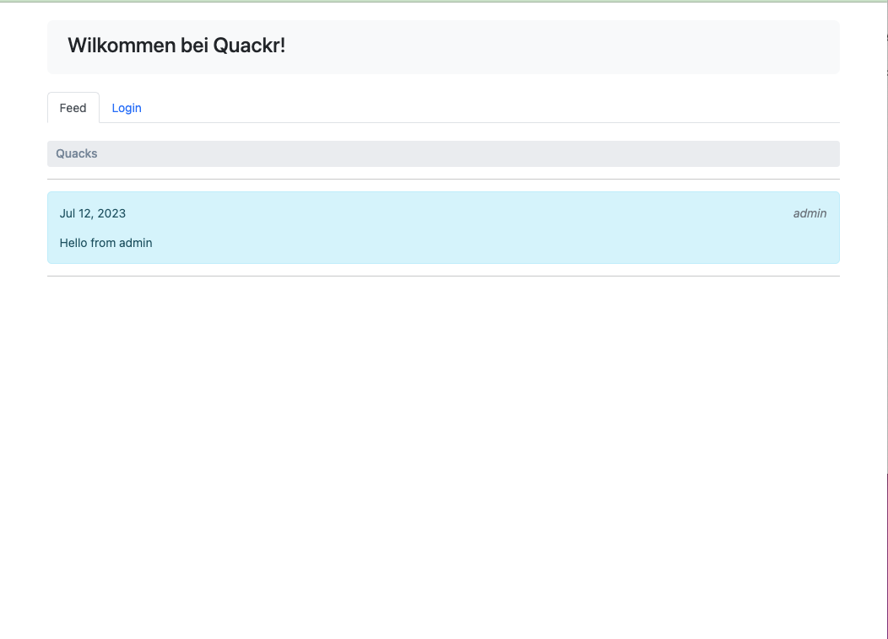
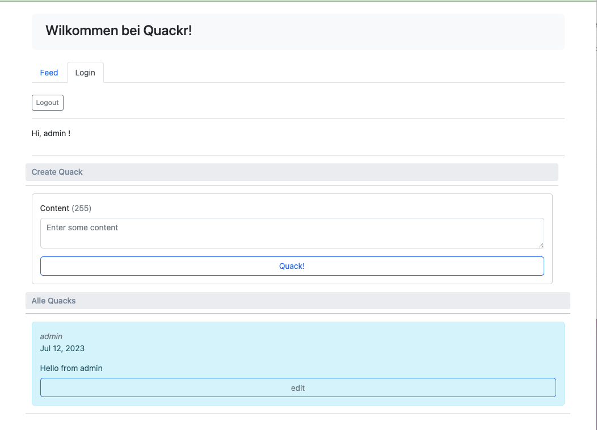

# Quack App

  The Quack application is a mini version of Twitter, where users create quack messages that they can edit in their personal account. 
Even on the main page, an unregistered user can see all quacks ever created.
  

    The administrator has special privileges and can edit and delete quacks from other users.
  

